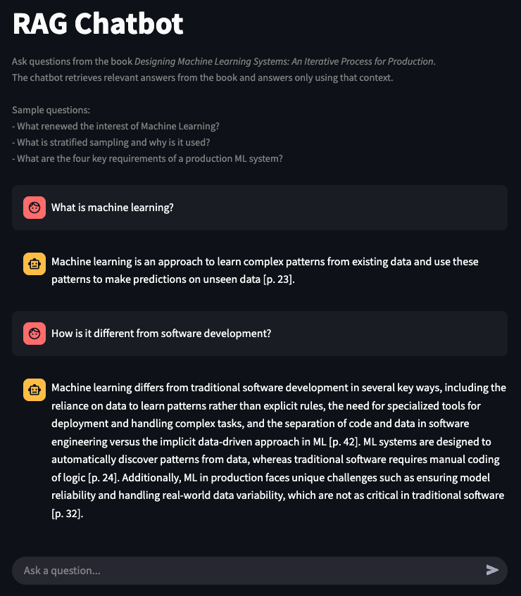
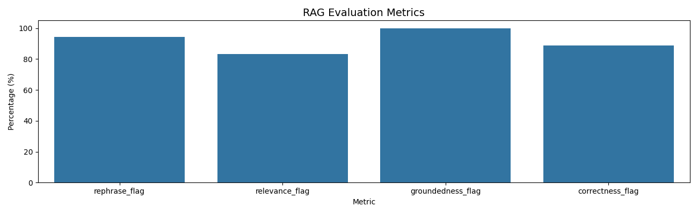

# RAG Chatbot

A lightweight retrieval-augmented generation (RAG) chatbot built to demonstrate how an enterprise-style RAG system can be implemented.

This project uses the book *Designing Machine Learning Systems: An Iterative Process for Production* as the indexed knowledge base. The chatbot retrieves relevant content from the vector database, reranks the retrieved chunks, and generates grounded answers with citations.

The project is intentionally designed as a simple enterprise-style RAG system focused on retrieval quality, grounded answering, citations, and evaluation.

---

## Chatbot Interface

Below is a screenshot of the chatbot interface:




## Method Walkthrough

The chatbot follows an enterprise-style RAG pipeline:

```text
User Question
    ↓
Question Rewriting
    ↓
Vector Retrieval
    ↓
Cross-Encoder Reranking
    ↓
Context Construction
    ↓
Grounded Answer Generation
    ↓
Citation + Guardrail Checks
    ↓
Final Answer
```

## Capabilities

- Retrieval-based grounded question answering
- Page-level citations
- Lightweight hallucination guardrails
- Streamlit chatbot interface
- Evaluation pipeline with LLM judges
- Conversation trace logging

---

## Tech Stack

- Streamlit
- LangChain
- ChromaDB
- Hugging Face Embeddings
- Hugging Face Cross Encoder
- Ollama (`qwen3:1.7b`)
- Pydantic

---

## Run the Chatbot Locally

### 1. Install dependencies

```bash
pip install -r requirements.txt
```

### 2. Start Ollama

Make sure Ollama is running locally and the required model is pulled.

```bash
ollama pull qwen3:1.7b
```

### 3. Run the Streamlit app

```bash
streamlit run app.py
```

---

## Evaluation

Run benchmark evaluations:

```bash
python -m src.evals
```

The evaluation pipeline checks:

- **Rephrase** — Whether the rewritten retrieval question preserves the original meaning and context.
- **Relevance** — Whether the retrieved chunks contain sufficient relevant information for answering the question.
- **Groundedness** — Whether the generated answer is fully supported by the retrieved context and citations.
- **Correctness** — Whether the generated answer matches the expected ground-truth answer.

### Evaluation Results



---

## Current Limitations

- The chatbot is primarily retrieval-focused and does not reliably support broader conversational or general knowledge interactions.
- The current implementation can experience relatively high response latency.
- The benchmark dataset used for evaluation is relatively small and may not fully capture edge cases or broader retrieval behaviors.

---

## Next Steps

- Add lightweight conversational behavior alongside retrieval-based answering.
- The pipeline requires optimization to improve response latency.
- Expand benchmark coverage with larger and more diverse evaluation Q&A.
